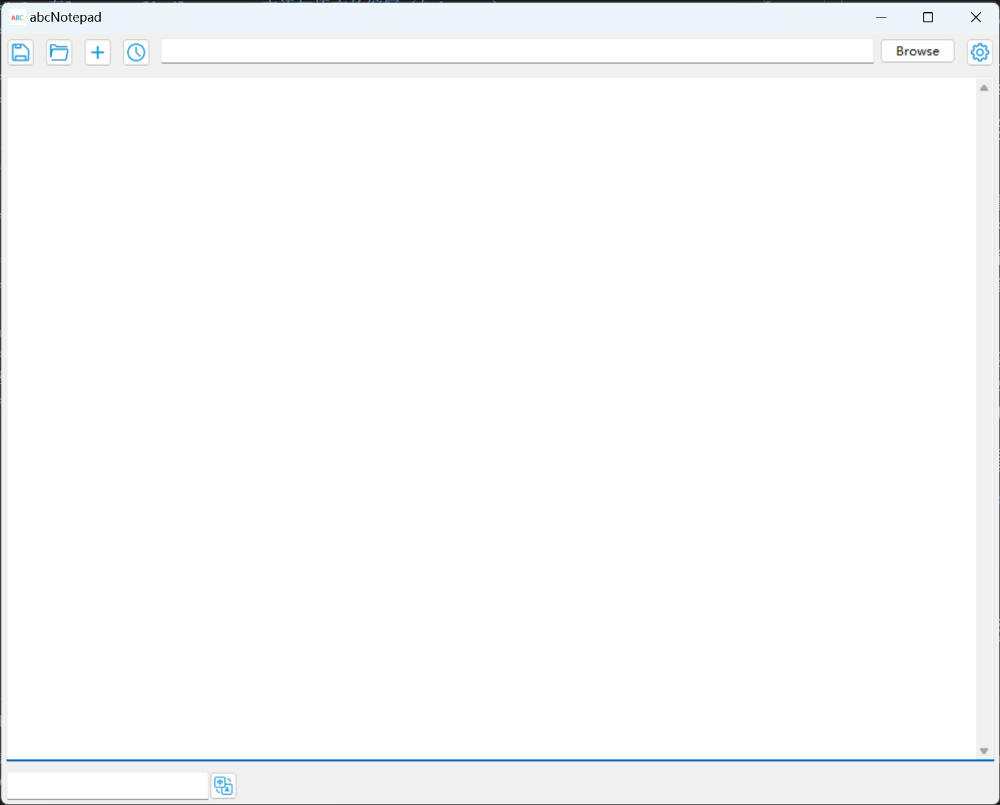

# Python-文本编辑器（Wx）
一个十分普通的文本编辑器

## 前置条件
* wxPython
* python 3.10
* 任意操作系统

## 使用方法
运行main.py即可

## 前置条件安装

`pip install wxpython`

## 添加语言
### 1、在strings.json中添加相应的字符串
### 2、在lang_config/languages中添加语言的缩写（如jp、en）
### 3、在lang_config中添加语言的全称（如"English":"en"）

## 新增功能
### 查找
查找功能已重写  
现在可以在下面的框中输入要查找的内容  
**将光标放在编辑框中**按下**ALT+方向键下**  
可仍然只能查找一个
### 翻译功能
按下下方的翻译按钮会在**软件目录下的translate中**生成一个文本文件  
***目前仅支持中/英文***
### 热键
新增了三个热键
1、退出：ALT+ESC  
2、保存：ALT+方向键上  
3、打开：ALT+方向键左
## 没人会看的联系方式
本人邮箱
jason20101230@outlook.com
## 已知bug
*暂无*
## 软件截图

## 声明
此软件为个人练习作品，绝非商用  
软件中的按钮图标均来源于iconfont.cn  
著作权归原作者所有